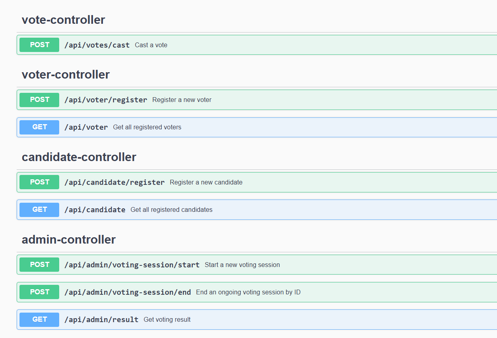
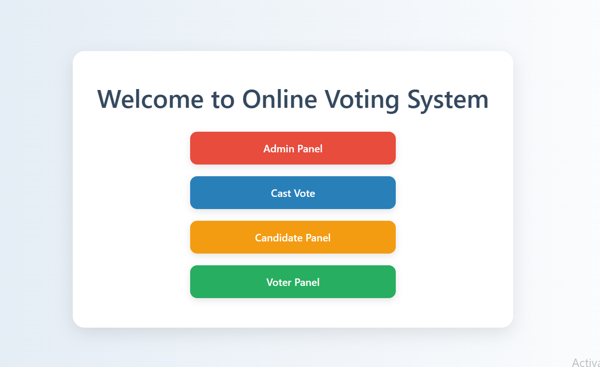
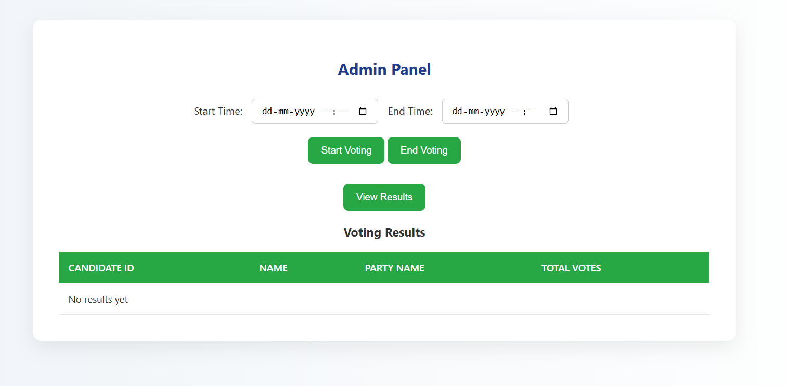
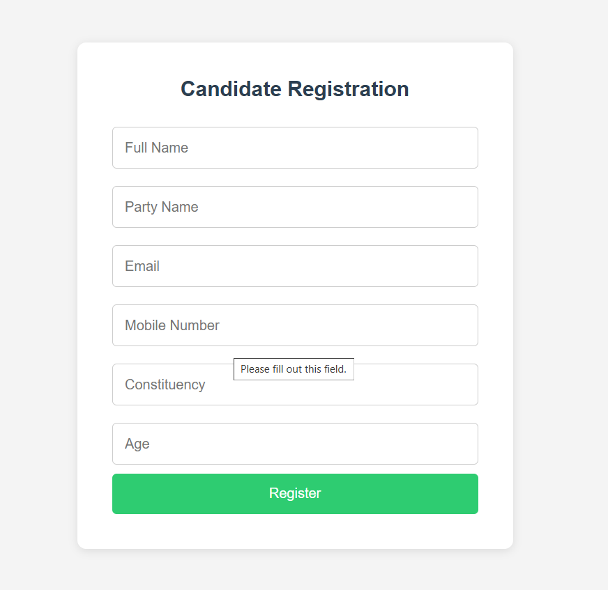
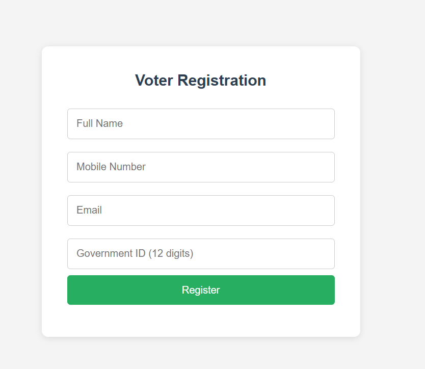
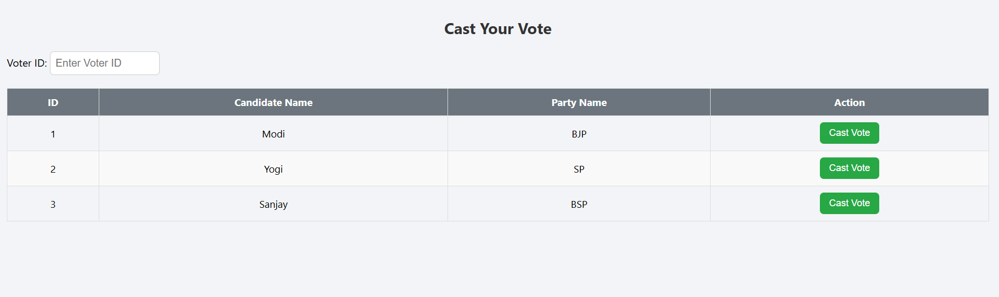

# Voting Application

A full-stack application to manage elections digitally, including voter and candidate registration, secure vote casting, live result monitoring, and session management. Built with Spring Boot and designed to be scalable and modular for real-world electoral processes.

---

## 🚀 Features

- ✅ Voter Registration with validation
- 🧾 Candidate Registration with validation
- 🗳️ Secure Vote Casting with one-vote policy
- 📊 Live result calculation
- 📅 Manage voting sessions (start/end)
- 🛡️ Validation, error handling
- 📱 Responsive UI with separate dashboards:
    - Admin Panel
    - Voter Panel
    - Candidate Panel

---

## 🧱 Tech Stack

### 🖥️ Backend:
- Java 17
- Spring Boot (REST APIs)
- Spring Data JPA
- Hibernate
- PostgreSQL (DB for development/testing)
- Maven
- Swagger/OpenAPI (for API documentation)

### 🌐 Frontend:
- HTML5
- CSS3 
- JavaScript 

---
## 🛡️ Validation & Security

- **Backend Validation** using `@NotBlank`, `@Pattern`, `@Email`
- **JavaScript Form Validation** before submitting
- **One Voter, One Vote** policy
- **Email & Mobile Format Validation**

---

---

## 📁 Project Structure

```
voting-system/
├── backend/
│   ├── controller/
│   ├── dto/
│   ├── model/
│   ├── repository/
│   └── service/
├── frontend/
│   ├── index.html
│   ├── common/
│   ├── voter/
│   ├── candidate/
│   ├── admin/
│   └── vote/
```

---

---
## 📦 API Endpoints

### 🧑 Voter Controller

| Method | Endpoint             | Description                     |
|--------|----------------------|---------------------------------|
| POST   | `/api/voters/register` | Register a new voter            |
| GET    | `/api/voters`          | Get all registered voters       |

### 🎯 Candidate Controller

| Method | Endpoint               | Description                       |
|--------|------------------------|-----------------------------------|
| POST   | `/api/candidates/register` | Register a new candidate         |
| GET    | `/api/candidates`         | Get all registered candidates    |

### 🗳️ Voting Controller

| Method | Endpoint             | Description          |
|--------|----------------------|----------------------|
| POST   | `/api/votes/cast`    | Cast a vote          |

### 📊 Admin Controller

| Method | Endpoint                     | Description                        |
|--------|------------------------------|------------------------------------|
| GET    | `/api/admin/result`          | Get voting results                 |
| POST   | `/api/admin/voting-session/start` | Start a new voting session    |
| POST   | `/api/admin/voting-session/end`   | End the current voting session |

---

## 🧪 Sample JSON Payloads

### Voter Registration

``` json
POST /api/voters/register
{
  "name": "John Doe",
  "email": "john@example.com",
  "age": 30,
  "voterId": "VOTER123"
}
```
### Candidate Registration
``` json
POST /api/candidates/register
{
  "name": "Alice Smith",
  "party": "Green Party",
  "candidateId": "CAND001"
}
```
### Cast Vote
``` json
POST /api/votes/cast
{
  "voterId": "VOTER123",
  "candidateId": "CAND001"
}
```

### Start Voting Session
``` json
POST /api/admin/voting-session/start
{
  "startTime": "2025-05-10T08:00:00",
  "endTime": "2025-05-10T18:00:00"
}
```
---

## 🚀 Getting Started

### ✅ Prerequisites
- Java 17 or higher
- Maven 3.6+

### 1. Clone the Repository

```bash
git clone https://github.com/yourusername/voting-application.git
cd voting-application
```

### 2. Backend Setup

- Import project into your IDE (IntelliJ, Eclipse, VS Code).
- Configure `application.yml` for your database.
- Run the Spring Boot application.

```bash
./mvnw spring-boot:run
```

### 3. Frontend Setup

- Open `index.html` in the browser.
- Navigate through the Admin, Voter, Candidate, or Voting dashboard.

---

## 🌍 Accessing the Application

- **Swagger UI (API Docs):**  
  📎 [http://localhost:8081/swagger-ui/index.html#/](http://localhost:8081/swagger-ui/index.html#/)

- **Expense Tracker UI:**  
  📎 [http://localhost:8081/voting-application/index.html](http://localhost:8081/voting-application/index.html)

---

## 🔐 Future Improvements
- JWT-based authentication and role-based access control
- Real-time vote tracking (WebSocket integration)
- Frontend dashboards for Admin, Voter, and Candidate roles
- Export reports (CSV/PDF)
- Audit logging and fraud prevention

---
## 🤝 Contributing
We welcome community contributions!
Feel free to fork the repo and submit pull requests.
---

# Sample

### Swagger UI (API Docs)

- All APIs:



### Voting Application UI

- Landing Page (index.html Page)



- Admin Panel



- Candidate Panel for Registration



- Voter Panel for Registration



- Cast Vote Page


